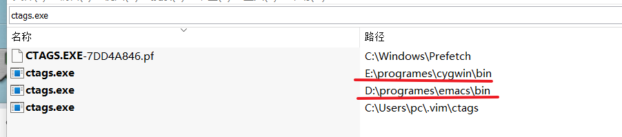

# emacs_config
emacs config for my personal use 

## 安装

可以在这个[链接](https://mirrors.ustc.edu.cn/gnu/emacs/windows/emacs-29/)找到windows版本的安装包。选择`zip`的压缩包可以不用安装直接使用。

安装启动`emacs`后，初始配置和安装包在这个目录: `C:\Users\pc\AppData\Roaming\.emacs.d`。具体的目录以你当前登录的用户名而定。

在这个目录下可以创建一个`init.el`文件，我们可以把我们的配置放这里。`emacs`加载配置文件的顺序是：

* ~/.emacs
* ~/.emacs.el
* ~/.emacs.d/init.el
* ~/.config/emacs/init.el

按照顺序，它找到一个配置文件，就会停止查找。

为了方便管理，我使用`init.el`文件，然后和`vim`的配置文件类似，还是使用`mklink`创建快捷方式的方式来进行管理。`emacs`使用的是一个远程链接，真正的配置文件在`git`仓库中管理。

```cmd
cd C:\Users\pc\AppData\Roaming\.emacs.d
C:
mklink init.el E:\code\emacs\emacs_config\init.el
```

>记得用管理员的权限来运行`cmd`


`emacs`执行过程中可能会依赖一些二进制文件，我们可以在配置目录下创建一个`bin`目录，用于放置二进制文件，并且也好管理，注意，需要把这个目录添加到环境变量中。

```txt
C:\Users\pc\AppData\Roaming\.emacs.d\bin
```

安装完`emacs`后，安装目录下默认会安装很多二进制文件，有些二进制文件在系统中已经存在重名的，但是功能不同。比如`ctags.exe`目前是有两个版本：

* Exuberant-ctags
* Universal-ctags

如果系统上已经安装了`Universal-ctags`了，那么为了其它的`ctags.exe`不会对真正的`Universal-ctags`产生影响，那么最好是把所有的`Exuberant-ctags`对应的`ctags.exe`备份起来。



比如上面的红线的标注的工具都改个名或者删除。不然`vim`的`tagbar`或者是`emacs`相关的功能都可能被影响。


## vim模式

作为`vim`用户，已经习惯了那套按键映射，所以为了在`emacs`中使用`vim`的映射，先安装插件`Evil`。

## 基本操作

* 重启emacs M-x restart-emacs

### 查找某个按键映射映射到什么函数

举个例子：

如果你想查看C-z当前映射到哪个命令，你可以在Emacs中使用describe-key函数。只需按下C-h k（或者M-x describe-key），然后按下你想查询的键（在这个例子中是C-z），Emacs就会显示该键当前绑定的命令。

## major mode

### markdown mode

#### 图片处理

## treesit


## tag系统


## 文件管理器

当前我使用的文件管理器是`neotree`，要正常使用它，有一些依赖

* 先安装`all-the-icons`这个包。
* 然后运行`M-x all-the-icons-install-fonts`这个命令，所有的字体文件会下载到一个目录下
* 手动进入字体文件下载的目录下，双击所有的字体文件，安装到`windows`系统中。


gge

gegegge
gegeg

geg

gegge geg

